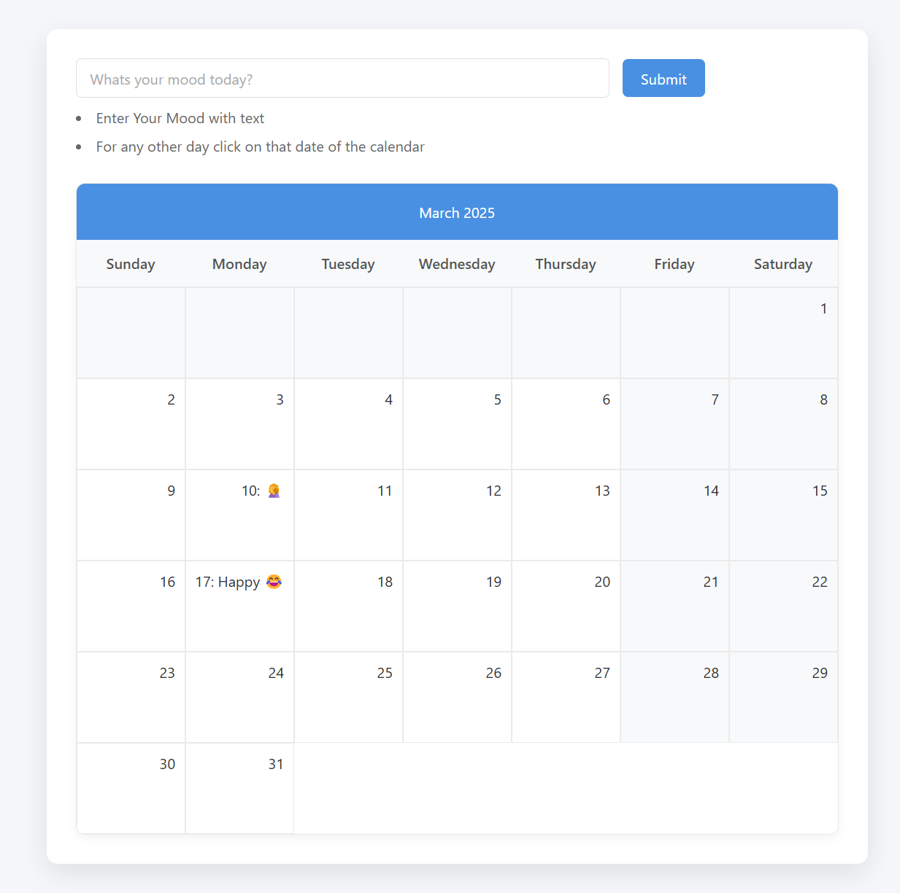

# Mood Tracker App

This is a simple Mood Tracker app that allows users to track their mood on specific dates using a calendar view.

## Features

- Users can select a specific date on the calendar.
- Users can enter their mood for that selected date.
- The entered mood is updated in the calendar view for easy tracking.

## How to Run

To run the app:

1. Open the `index.html` file with a live server or any other suitable method to serve the HTML file.
2. The app should load and display the calendar view.
3. Click on any specific date to enter and update the mood for that day.

## Look of the Webpage

Here’s a sample look of the webpage:

## Technologies Used

- HTML
- CSS
- JavaScript (for handling date and mood input)
